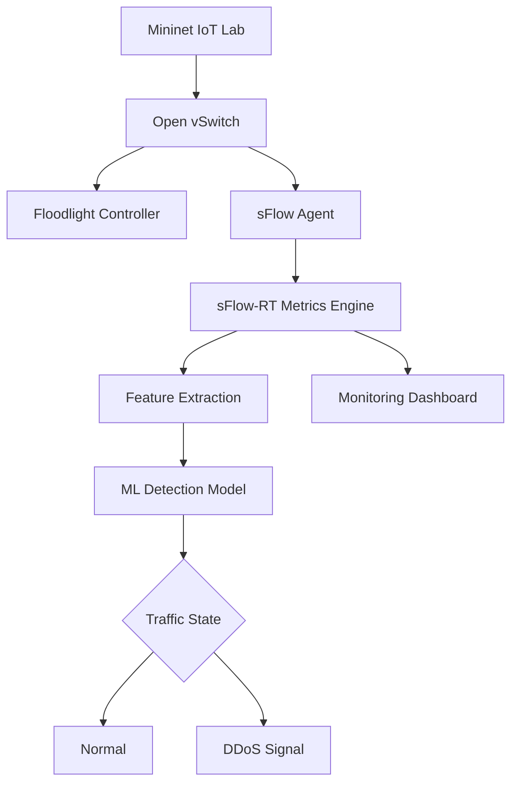
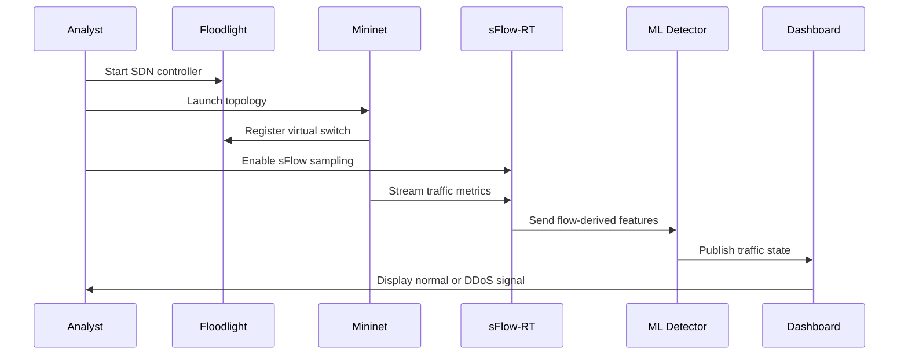
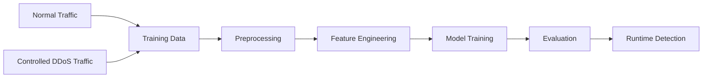

<div align="center">

<br />

# DDoS Attack Detection in IoT

### Real-Time SDN Threat Intelligence System

<p>
  <strong>Live telemetry.</strong> <strong>Flow intelligence.</strong> <strong>Machine learning detection.</strong>
</p>

<p>
  A polished research-engineering system for detecting DDoS behavior inside a controlled IoT-style software-defined network.
</p>

<p>
  <code>Mininet</code> · <code>Floodlight</code> · <code>sFlow-RT</code> · <code>Open vSwitch</code> · <code>Python</code> · <code>Machine Learning</code>
</p>

<br />

</div>

---

<div align="center">

<table>
<tr>
<td align="center" width="25%">

<strong>Mode</strong><br />
Real-Time Detection

</td>
<td align="center" width="25%">

<strong>Domain</strong><br />
IoT Security

</td>
<td align="center" width="25%">

<strong>Architecture</strong><br />
SDN + Telemetry

</td>
<td align="center" width="25%">

<strong>Runtime</strong><br />
Linux / Ubuntu

</td>
</tr>
</table>

</div>

---

## 01 · Product View

<table>
<tr>
<td width="58%" valign="top">

### Real-time security lab for intelligent network defense

This repository presents a controlled IoT-style DDoS detection environment built with software-defined networking, live traffic sampling, and machine learning classification.

The project is designed to feel like a compact security product: a clear control plane, a measurable telemetry layer, a detection engine, and a dashboard-oriented workflow for validating network behavior.

</td>
<td width="42%" valign="top">

```text
┌──────────────────────────────┐
│  IoT Threat Intelligence     │
├──────────────────────────────┤
│  Signal     Live Flow Data   │
│  Control    Floodlight SDN   │
│  Telemetry  sFlow-RT         │
│  Decision   ML Classifier    │
│  Output     Normal / DDoS    │
└──────────────────────────────┘
```

</td>
</tr>
</table>

---

## 02 · Experience Design

<table>
<tr>
<td width="33%" valign="top">

### Clean Lab Setup

A focused Linux-based environment for launching the controller, topology, telemetry stream, and detection workflow.

</td>
<td width="33%" valign="top">

### Live Network Signal

sFlow telemetry converts moving traffic into measurable behavior that can be inspected and classified.

</td>
<td width="33%" valign="top">

### Detection Output

The machine learning layer converts extracted features into a clean normal-versus-attack decision signal.

</td>
</tr>
</table>

---

## 03 · System Architecture



<table>
<tr>
<td width="50%" valign="top">

### Control Plane

Floodlight acts as the SDN controller and coordinates switch behavior across the emulated topology.

</td>
<td width="50%" valign="top">

### Data Plane

Mininet and Open vSwitch create a repeatable network environment for host-to-host traffic observation.

</td>
</tr>
<tr>
<td width="50%" valign="top">

### Telemetry Plane

sFlow samples packet and flow behavior, then streams metrics into sFlow-RT for live inspection.

</td>
<td width="50%" valign="top">

### Intelligence Plane

The ML detector consumes traffic-derived features and classifies the network state as normal or attack-like.

</td>
</tr>
</table>

---

## 04 · Detection Flow



---

## 05 · Core Capabilities

| Capability | Premium Engineering Framing |
|---|---|
| Real-time observation | Monitors live network behavior rather than relying only on static files. |
| SDN control | Uses a controller-driven architecture for clean experiment orchestration. |
| Flow telemetry | Turns traffic into measurable signals through sFlow and sFlow-RT. |
| ML classification | Applies a trained detector to separate normal and attack-like behavior. |
| Lab repeatability | Runs inside a controlled Mininet topology for reproducible experimentation. |
| Defensive validation | Supports authorized security research and network defense education. |

---

## 06 · Machine Learning Workflow



| Stage | Output |
|---|---|
| Traffic capture | Normal and controlled attack traffic observations. |
| Preprocessing | Clean numerical feature vectors. |
| Feature engineering | Detection-ready traffic behavior signals. |
| Model training | Supervised classifier for DDoS detection. |
| Runtime inference | Live normal / attack classification. |

```text
Recommended metrics: Accuracy · Precision · Recall · F1-score · Confusion Matrix · False Positive Rate · Detection Latency
```

---

## 07 · Technology Stack

<table>
<tr>
<td width="25%" valign="top">

**Network Lab**

Mininet  
Open vSwitch  
Linux / Ubuntu

</td>
<td width="25%" valign="top">

**SDN Control**

Floodlight  
OpenFlow  
Remote Controller

</td>
<td width="25%" valign="top">

**Telemetry**

sFlow  
sFlow-RT  
Metric Browser

</td>
<td width="25%" valign="top">

**Detection**

Python  
Scikit-learn  
Pandas  
NumPy

</td>
</tr>
</table>

---

## 08 · Installation

> Recommended platform: Ubuntu or a Linux VM with Mininet support.

```bash
git clone https://github.com/ns7523/DDoS-attack-in-IoT-Real-Time.git
cd DDoS-attack-in-IoT-Real-Time
```

```bash
python3 -m venv .venv
source .venv/bin/activate
pip install pandas numpy scikit-learn
```

| Dependency | Purpose |
|---|---|
| Mininet | Network emulation runtime. |
| Floodlight | SDN controller. |
| sFlow-RT | Live telemetry and metric visualization. |
| hping3 | Optional controlled lab traffic generator. |

Reference: [`Installation Guide.pdf`](Installation%20Guide.pdf)

---

## 09 · Usage

Command reference: [`Commands.txt`](Commands.txt)

### Start Floodlight

```bash
cd floodlight
java -jar target/floodlight.jar
```

### Launch Mininet

```bash
sudo mn --controller=remote,ip=127.0.0.1,port=6653 --topo=single,3
```

### Start detection runtime

```bash
cd ns-ddos
sudo ./start.sh
```

### Enable sFlow telemetry

```bash
sudo ovs-vsctl -- --id=@sflow create sflow agent=eth0 target=\"127.0.0.1:6343\" sampling=10 polling=20 -- -- set bridge s1 sflow=@sflow
```

### Open dashboards

```text
Floodlight UI    http://localhost:8080/ui/pages/index.html
sFlow-RT UI      http://localhost:8008/metric/127.0.0.1/html
```

### Open Mininet host terminals

```bash
xterm h1 h2 h3
```

---

## 10 · Dataset & Traffic Model

The real-time workflow uses traffic generated inside a controlled Mininet topology. Normal host-to-host communication creates baseline behavior, while controlled lab traffic simulates DDoS-style pressure for detection testing.

| Data Signal | Role |
|---|---|
| Normal traffic | Baseline network behavior. |
| Controlled DDoS traffic | Attack-like behavior inside the authorized lab. |
| sFlow metrics | Flow-level telemetry used for feature extraction. |
| Labels | Normal or attack state for classification. |

---

## 11 · Screenshots & Visual Assets

Place polished visuals in `assets/screenshots/`.

<table>
<tr>
<td width="50%" valign="top">

### Controller View

`assets/screenshots/floodlight-dashboard.png`

Topology and switch visibility through Floodlight.

</td>
<td width="50%" valign="top">

### Metrics View

`assets/screenshots/sflow-metric-browser.png`

Live sFlow-RT telemetry and flow trends.

</td>
</tr>
<tr>
<td width="50%" valign="top">

### Detection View

`assets/screenshots/ddos-detection.png`

Normal-versus-DDoS runtime signal.

</td>
<td width="50%" valign="top">

### Architecture View

`assets/screenshots/architecture.png`

Clean visual map of the SDN + telemetry + ML system.

</td>
</tr>
</table>

---

## 12 · Project Structure

Recommended premium repository structure:

```text
.
├── assets/
│   └── screenshots/
├── data/
│   ├── raw/
│   └── processed/
├── docs/
│   ├── architecture.md
│   ├── detection-methodology.md
│   └── installation.md
├── models/
│   └── detector.pkl
├── results/
│   ├── metrics.json
│   └── latency-report.md
├── scripts/
│   ├── configure-sflow.sh
│   ├── start-controller.sh
│   └── start-mininet.sh
├── src/
│   ├── collector.py
│   ├── detector.py
│   ├── features.py
│   └── monitor.py
├── Commands.txt
├── requirements.txt
└── README.md
```

---

## 13 · Engineering Significance

This project demonstrates how AI security systems can be composed from multiple disciplined layers: controlled infrastructure, real-time telemetry, feature extraction, detection modeling, and visual monitoring.

It is not just a script; it is a security system concept that can evolve toward production-style network monitoring, IoT threat intelligence, and automated defensive response.

---

## 14 · Roadmap

- [ ] Add pinned `requirements.txt`.
- [ ] Move runtime code into `src/`.
- [ ] Add clean setup scripts for controller, topology, and sFlow.
- [ ] Add `docs/architecture.md` and `docs/detection-methodology.md`.
- [ ] Add detection latency, precision, recall, and F1-score reports.
- [ ] Add curated screenshots under `assets/screenshots/`.
- [ ] Add a reproducible Linux VM or Docker-based setup guide.
- [ ] Add a formal open-source license.

---

## 15 · Defensive Use Notice

This repository is for authorized security research, controlled lab experimentation, and defensive network engineering education. Keep all traffic generation inside Mininet or networks you own or have explicit permission to test.

---

<div align="center">

### N S Akash

**AI & Cybersecurity Engineer**

[GitHub](https://github.com/ns7523) · [LinkedIn](https://www.linkedin.com/in/nsakash7523) · [Portfolio](https://nsakash.in) · [Email](mailto:nsakash752003@gmail.com)

</div>
