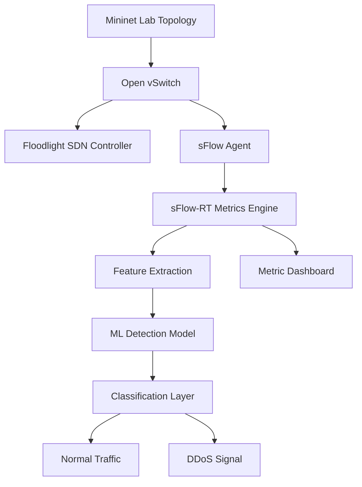
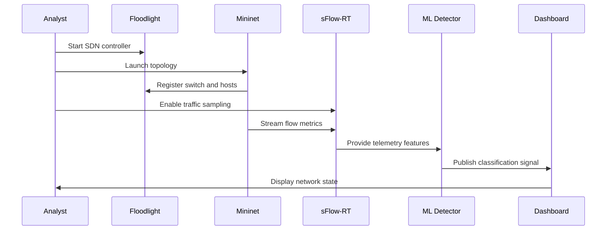
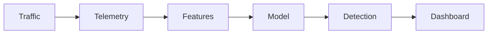
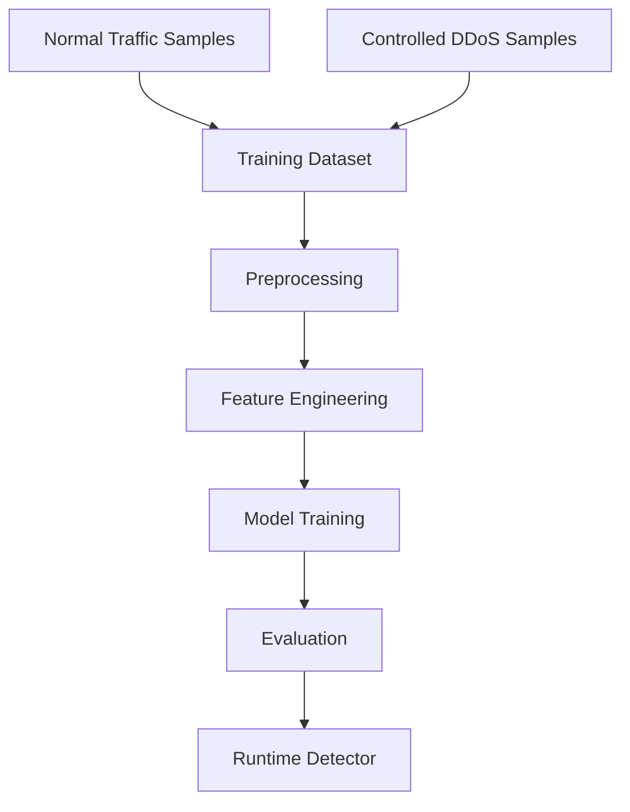

<div align="center">

<br />

# DDoS Attack Detection in IoT

### Real-Time SDN Threat Detection System

<p>
  <strong>Mininet</strong> · <strong>Floodlight</strong> · <strong>sFlow-RT</strong> · <strong>Machine Learning</strong> · <strong>IoT Security</strong>
</p>

<p>
  A clean research-grade implementation for observing live network telemetry, extracting flow behavior, and detecting DDoS activity inside a controlled software-defined IoT network.
</p>

<br />

</div>

---

<div align="center">

| Signal | Runtime | Focus | Environment |
|---|---|---|---|
| Real-time traffic intelligence | SDN telemetry pipeline | DDoS detection | Linux / Ubuntu |

</div>

---

## 01 · Overview

**DDoS Attack Detection in IoT** is a real-time cybersecurity research project that combines network emulation, SDN control, traffic telemetry, and machine learning to detect abnormal traffic behavior in an IoT-style environment.

The system is built around a simple but powerful idea: observe live network flow behavior, transform telemetry into detection-ready signals, and classify whether the network is operating normally or showing DDoS-like behavior.

```text
Purpose     Real-time DDoS detection in an emulated IoT network
Method      SDN + sFlow telemetry + ML-based classification
Audience    Security researchers, network engineers, AI security builders
Status      Research prototype / engineering portfolio system
```

---

## 02 · Design Principles

<table>
<tr>
<td width="33%" valign="top">

### Minimal Surface

The system keeps the workflow focused: launch the network, collect telemetry, detect abnormal behavior, observe results.

</td>
<td width="33%" valign="top">

### Research Clarity

Every layer has a clear role: emulation, control, telemetry, feature extraction, detection, and visualization.

</td>
<td width="33%" valign="top">

### Security-First Scope

Traffic generation is limited to a controlled lab topology and is intended only for defensive research.

</td>
</tr>
</table>

---

## 03 · System Architecture



<table>
<tr>
<td width="50%" valign="top">

### Control Plane

Floodlight manages the software-defined network and coordinates switch behavior across the emulated topology.

</td>
<td width="50%" valign="top">

### Data Plane

Mininet and Open vSwitch generate and route traffic between virtual hosts in a controlled environment.

</td>
</tr>
<tr>
<td width="50%" valign="top">

### Telemetry Plane

sFlow samples traffic and streams metrics into sFlow-RT for live observation and analysis.

</td>
<td width="50%" valign="top">

### Detection Plane

A machine learning layer classifies network behavior based on extracted flow-level features.

</td>
</tr>
</table>

---

## 04 · Key Features

| Feature | Engineering Value |
|---|---|
| Real-time traffic monitoring | Observes live flow behavior instead of relying only on static samples. |
| SDN-based experiment design | Uses Floodlight and Open vSwitch for controlled network behavior. |
| Mininet network emulation | Creates repeatable host and switch topologies for security testing. |
| sFlow-RT telemetry | Provides metric-level visibility into flow trends and traffic changes. |
| ML-driven detection | Converts network behavior into a classification problem. |
| Dashboard-oriented workflow | Supports visual validation through Floodlight and sFlow-RT interfaces. |

---

## 05 · Real-Time Detection Flow



---

## 06 · Detection Methodology

The detection pipeline follows a research-oriented security workflow:

| Step | Description |
|---|---|
| 1 | Create a controlled IoT-style topology in Mininet. |
| 2 | Connect the topology to a remote Floodlight controller. |
| 3 | Enable sFlow telemetry on the Open vSwitch bridge. |
| 4 | Collect traffic metrics through sFlow-RT. |
| 5 | Transform flow observations into feature values. |
| 6 | Apply the trained detection model. |
| 7 | Interpret the output as normal or attack behavior. |



---

## 07 · Machine Learning Workflow



| Stage | Output |
|---|---|
| Traffic collection | Normal and attack traffic observations. |
| Preprocessing | Cleaned numerical features. |
| Model training | Supervised classifier for traffic state prediction. |
| Evaluation | Accuracy, precision, recall, F1-score, false-positive signal. |
| Runtime inference | Real-time normal / attack classification. |

Recommended metrics:

```text
Accuracy · Precision · Recall · F1-score · Confusion Matrix · False Positive Rate · Detection Latency
```

---

## 08 · Tech Stack

<table>
<tr>
<td width="25%" valign="top">

**Network Lab**

Mininet  
Open vSwitch  
Linux / Ubuntu

</td>
<td width="25%" valign="top">

**SDN Control**

Floodlight  
Remote Controller  
OpenFlow

</td>
<td width="25%" valign="top">

**Telemetry**

sFlow  
sFlow-RT  
Metric Browser

</td>
<td width="25%" valign="top">

**Detection**

Python  
Scikit-learn  
Pandas  
NumPy

</td>
</tr>
</table>

---

## 09 · Installation

> Recommended platform: Ubuntu or a Linux VM with Mininet support.

Clone the repository:

```bash
git clone https://github.com/ns7523/DDoS-attack-in-IoT-Real-Time.git
cd DDoS-attack-in-IoT-Real-Time
```

Create a Python environment:

```bash
python3 -m venv .venv
source .venv/bin/activate
pip install pandas numpy scikit-learn
```

Install the required network tooling:

| Dependency | Purpose |
|---|---|
| Mininet | Emulated topology runtime. |
| Floodlight | SDN controller. |
| sFlow-RT | Flow telemetry and metric dashboard. |
| hping3 | Optional traffic generation inside the authorized lab. |

Additional reference: [`Installation Guide.pdf`](Installation%20Guide.pdf)

---

## 10 · Usage

The operational command sequence is documented in [`Commands.txt`](Commands.txt).

### Start Floodlight

```bash
cd floodlight
java -jar target/floodlight.jar
```

### Launch Mininet

```bash
sudo mn --controller=remote,ip=127.0.0.1,port=6653 --topo=single,3
```

### Start the detection application

```bash
cd ns-ddos
sudo ./start.sh
```

### Enable sFlow telemetry

```bash
sudo ovs-vsctl -- --id=@sflow create sflow agent=eth0 target=\"127.0.0.1:6343\" sampling=10 polling=20 -- -- set bridge s1 sflow=@sflow
```

### Open dashboards

```text
Floodlight UI    http://localhost:8080/ui/pages/index.html
sFlow-RT UI      http://localhost:8008/metric/127.0.0.1/html
```

### Open host terminals

```bash
xterm h1 h2 h3
```

Traffic generation should remain inside the controlled Mininet lab environment.

---

## 11 · Dataset Overview

The real-time workflow uses traffic generated inside the Mininet lab. The dataset is composed of normal host traffic, controlled DDoS-style lab traffic, and flow-level telemetry sampled through sFlow.

| Data Type | Role |
|---|---|
| Normal traffic | Baseline network behavior. |
| Controlled DDoS traffic | Attack-like behavior generated inside the authorized lab. |
| Flow metrics | Telemetry used for feature extraction. |
| Labels | Normal / attack classification targets. |

---

## 12 · Screenshots

Add visual assets under `assets/screenshots/` for a premium repository presentation.

<table>
<tr>
<td width="50%" valign="top">

### Dashboard

`assets/screenshots/floodlight-dashboard.png`

Controller view showing switch and topology visibility.

</td>
<td width="50%" valign="top">

### Metrics

`assets/screenshots/sflow-metric-browser.png`

sFlow-RT metric browser showing live flow telemetry.

</td>
</tr>
<tr>
<td width="50%" valign="top">

### Detection

`assets/screenshots/ddos-detection.png`

Real-time detection output during controlled attack simulation.

</td>
<td width="50%" valign="top">

### Architecture

`assets/screenshots/architecture.png`

System-level architecture diagram for the SDN + ML workflow.

</td>
</tr>
</table>

---

## 13 · Project Structure

Recommended structure for a production-grade research repository:

```text
.
├── assets/
│   └── screenshots/
├── data/
│   ├── raw/
│   └── processed/
├── docs/
│   ├── installation.md
│   ├── architecture.md
│   └── detection-methodology.md
├── models/
│   └── detector.pkl
├── results/
│   ├── metrics.json
│   └── latency-report.md
├── scripts/
│   ├── start-controller.sh
│   ├── start-mininet.sh
│   └── configure-sflow.sh
├── src/
│   ├── collector.py
│   ├── features.py
│   ├── detector.py
│   └── monitor.py
├── Commands.txt
├── requirements.txt
└── README.md
```

---

## 14 · Engineering Significance

This repository demonstrates a complete security-engineering concept rather than a single isolated script:

- It connects SDN control with real-time telemetry.
- It translates network behavior into ML-ready signals.
- It validates detection logic inside a repeatable lab environment.
- It provides a foundation for intelligent IoT network defense systems.
- It can evolve into a production-style monitoring and detection pipeline.

---

## 15 · Roadmap

- [ ] Add pinned `requirements.txt`.
- [ ] Move runtime logic into `src/`.
- [ ] Add automated scripts for controller, topology, and sFlow setup.
- [ ] Add `docs/architecture.md` and `docs/detection-methodology.md`.
- [ ] Add model metrics and detection latency reports.
- [ ] Add curated screenshots under `assets/screenshots/`.
- [ ] Add Docker or VM-based reproducibility instructions.
- [ ] Add a formal open-source license.

---

## 16 · Defensive Use Notice

This repository is intended for authorized lab research, network defense education, and controlled security experimentation only. Do not generate traffic against public systems or networks you do not own or have explicit permission to test.

---

## 17 · Contact

**N S Akash**  
AI & Cybersecurity Engineer

[GitHub](https://github.com/ns7523) · [LinkedIn](https://www.linkedin.com/in/nsakash7523) · [Portfolio](https://nsakash.in) · [Email](mailto:nsakash752003@gmail.com)
