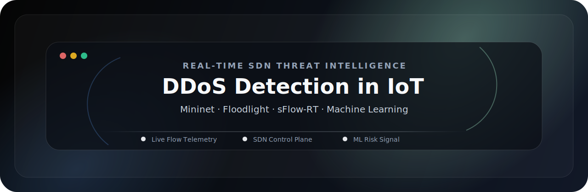
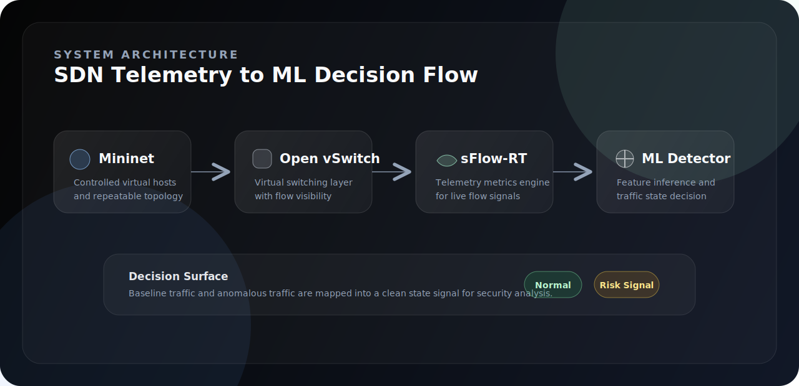
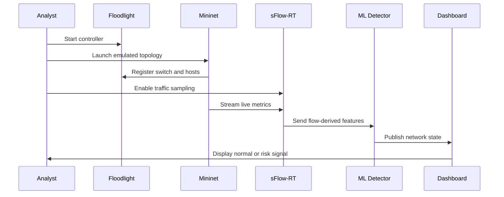
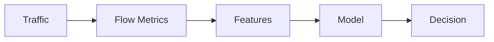
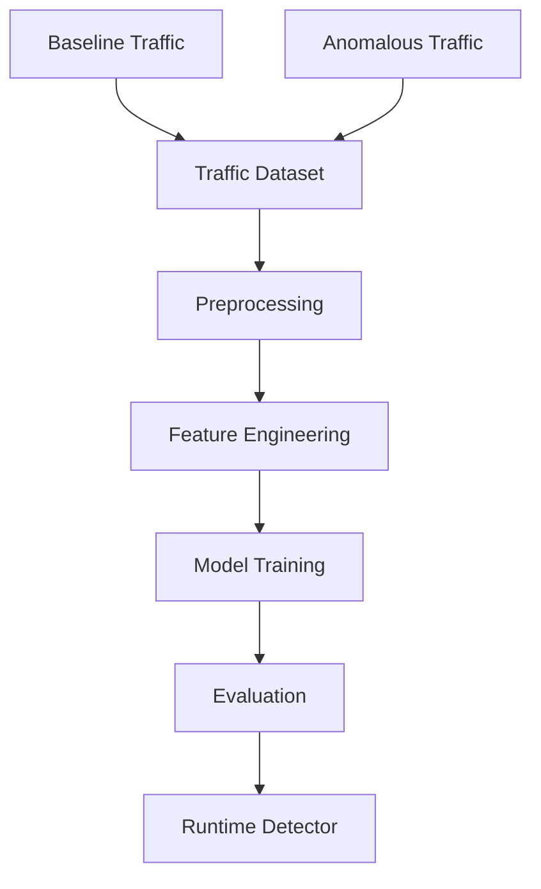

<div align="center">



<br />

<p>
  <strong>Observe live traffic.</strong> <strong>Extract flow signals.</strong> <strong>Classify network risk.</strong>
</p>

<p>
  
  
  
  
</p>

</div>

---

<div align="center">

<table>
<tr>
<td align="center" width="25%"><strong>Mode</strong><br />Real-Time</td>
<td align="center" width="25%"><strong>Domain</strong><br />IoT Security</td>
<td align="center" width="25%"><strong>Pattern</strong><br />SDN Telemetry</td>
<td align="center" width="25%"><strong>Runtime</strong><br />Ubuntu Lab</td>
</tr>
</table>

</div>

---

## 01 · Overview

<table>
<tr>
<td width="58%" valign="top">

### A clean security console for live network intelligence

This repository presents a controlled IoT-style DDoS detection environment built with software-defined networking, live traffic telemetry, and machine learning classification.

The project is structured like a compact engineering product: topology, controller, telemetry engine, feature pipeline, detection layer, and monitoring interface.

</td>
<td width="42%" valign="top">

```text
┌──────────────────────────────┐
│  SDN THREAT CONSOLE          │
├──────────────────────────────┤
│  Network     Mininet Lab     │
│  Control     Floodlight      │
│  Telemetry   sFlow-RT        │
│  Model       ML Detector     │
│  Output      Normal / Risk   │
└──────────────────────────────┘
```

</td>
</tr>
</table>

---

## 02 · System Architecture



---

## 03 · Detection Flow



---

## 04 · Pipeline

<table>
<tr>
<td width="20%" valign="top"><strong>01</strong><br />Traffic observation</td>
<td width="20%" valign="top"><strong>02</strong><br />Flow telemetry</td>
<td width="20%" valign="top"><strong>03</strong><br />Metric capture</td>
<td width="20%" valign="top"><strong>04</strong><br />Feature extraction</td>
<td width="20%" valign="top"><strong>05</strong><br />State classification</td>
</tr>
</table>



---

## 05 · Key Features

| Feature | Purpose |
|---|---|
| Real-time traffic observation | Tracks live network behavior instead of only static logs. |
| SDN-based control | Keeps the network lab structured and repeatable. |
| Flow telemetry | Converts traffic activity into measurable signals. |
| ML classification | Maps flow-derived features into a network-state decision. |
| Dashboard workflow | Supports visual analysis through Floodlight and sFlow-RT. |
| Defensive lab scope | Built for authorized research and network defense education. |

---

## 06 · Machine Learning Workflow



| Stage | Output |
|---|---|
| Capture | Baseline and anomalous traffic observations. |
| Prepare | Clean numerical features from flow metrics. |
| Train | Supervised model for traffic-state prediction. |
| Evaluate | Accuracy, precision, recall, F1-score, false-positive rate. |
| Deploy | Runtime detector connected to live telemetry. |

---

## 07 · Tech Stack

<table>
<tr>
<td width="25%" valign="top">

**Network Lab**

Mininet  
Open vSwitch  
Ubuntu

</td>
<td width="25%" valign="top">

**Control**

Floodlight  
OpenFlow  
Remote Controller

</td>
<td width="25%" valign="top">

**Telemetry**

sFlow  
sFlow-RT  
Metric Browser

</td>
<td width="25%" valign="top">

**Detection**

Python  
Scikit-learn  
Pandas  
NumPy

</td>
</tr>
</table>

---

## 08 · Installation

> Recommended platform: Ubuntu or a Linux VM with Mininet support.

```bash
git clone https://github.com/ns7523/DDoS-attack-in-IoT-Real-Time.git
cd DDoS-attack-in-IoT-Real-Time
```

```bash
python3 -m venv .venv
source .venv/bin/activate
pip install pandas numpy scikit-learn
```

Reference: [`Installation Guide.pdf`](Installation%20Guide.pdf)

---

## 09 · Usage

Command reference: [`Commands.txt`](Commands.txt)

```bash
cd floodlight
java -jar target/floodlight.jar
```

```bash
sudo mn --controller=remote,ip=127.0.0.1,port=6653 --topo=single,3
```

```bash
cd ns-ddos
sudo ./start.sh
```

```text
Floodlight UI    http://localhost:8080/ui/pages/index.html
sFlow-RT UI      http://localhost:8008/metric/127.0.0.1/html
```

---

## 10 · Project Structure

```text
.
├── assets/
│   ├── brand/
│   │   ├── architecture.svg
│   │   └── hero.svg
│   └── screenshots/
├── Commands.txt
├── Installation Guide.pdf
└── README.md
```

Suggested production structure:

```text
docs/ · src/ · scripts/ · models/ · data/ · results/ · assets/screenshots/ · requirements.txt
```

---

## 11 · Visual Assets

<table>
<tr>
<td width="50%" valign="top">

### Controller Dashboard

`assets/screenshots/floodlight-dashboard.png`

SDN topology, switch registration, and controller status.

</td>
<td width="50%" valign="top">

### Telemetry Dashboard

`assets/screenshots/sflow-metric-browser.png`

Live sFlow-RT telemetry and flow trends.

</td>
</tr>
<tr>
<td width="50%" valign="top">

### Detection State

`assets/screenshots/detection-state.png`

Normal-versus-risk classification output.

</td>
<td width="50%" valign="top">

### System Map

`assets/screenshots/architecture.png`

Polished architecture diagram for the SDN + ML pipeline.

</td>
</tr>
</table>

---

## 12 · Roadmap

- [ ] Add pinned `requirements.txt`.
- [ ] Move runtime logic into `src/`.
- [ ] Add setup scripts for controller, topology, and telemetry.
- [ ] Add screenshots under `assets/screenshots/`.
- [ ] Add model metrics and detection latency report.
- [ ] Add a formal open-source license.

---

## 13 · Defensive Use Notice

This project is for authorized security research, controlled lab experimentation, and defensive network engineering education. Keep all traffic generation inside Mininet or networks you own or have explicit permission to test.

---

<div align="center">

### N S Akash

**AI & Cybersecurity Engineer**

<p>
  <a href="https://github.com/ns7523"></a>
  <a href="https://nsakash.in"></a>
  <a href="mailto:contact@nsakash.in"></a>
  <a href="https://www.linkedin.com/in/nsakash7523"></a>
</p>

</div>
