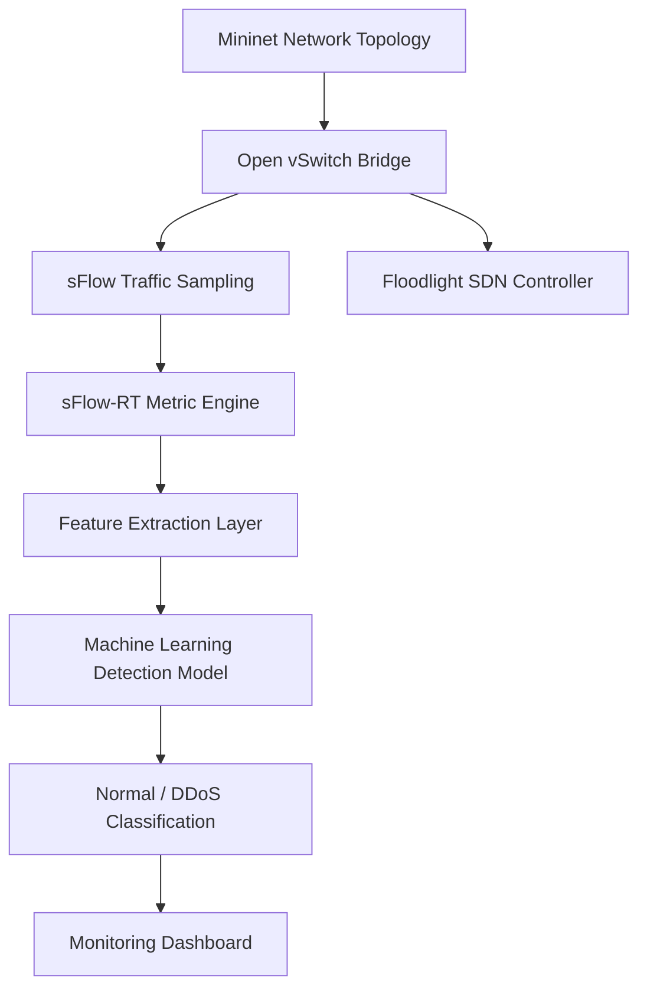
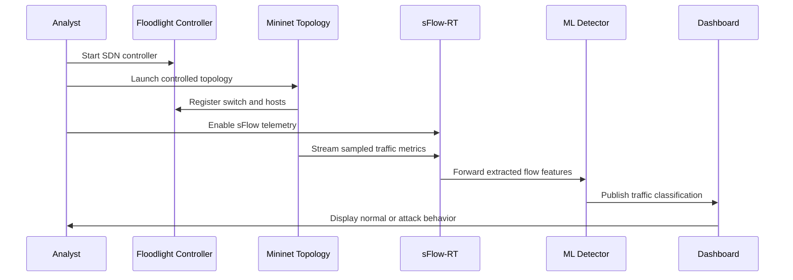
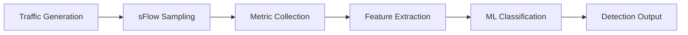
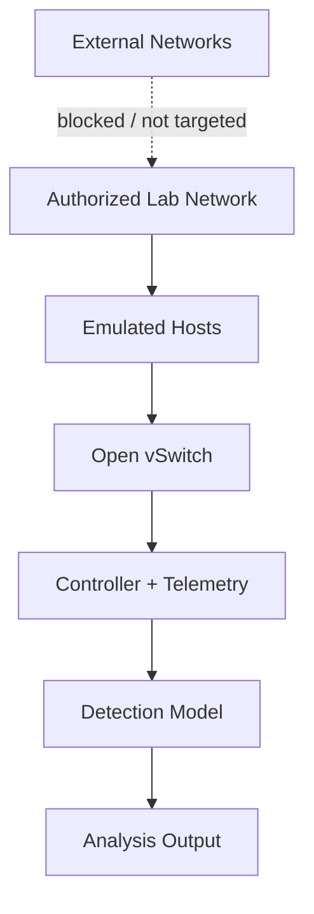

<div align="center">

# DDoS Attack Detection in IoT — Real-Time SDN Analysis

**Real-Time Machine Learning Framework for IoT DDoS Detection using Mininet, Floodlight, and sFlow-RT**

`IoT Security` · `DDoS Detection` · `SDN` · `sFlow-RT` · `Mininet` · `Machine Learning`

A research-engineered cybersecurity system for observing live network traffic, extracting flow telemetry, and detecting Distributed Denial-of-Service behavior in a controlled IoT-style software-defined networking environment.

</div>

---

## Overview

**DDoS Attack Detection in IoT — Real-Time SDN Analysis** implements an end-to-end real-time threat detection workflow for IoT network environments. The project combines Mininet-based network emulation, Floodlight SDN control, sFlow-RT telemetry, and machine learning classification to detect abnormal traffic behavior as it occurs.

The system is designed as a controlled research prototype for studying how real-time traffic sampling and ML-assisted detection can support intelligent network defense.

```text
Objective   Detect DDoS behavior from live IoT-style network traffic
Method      SDN telemetry + feature extraction + machine learning prediction
Runtime     Linux / Ubuntu lab environment
Interface   Floodlight UI, sFlow-RT metrics, browser-based monitoring
```

---

## Key Features

| Capability | Description |
|---|---|
| Real-Time Detection | Monitors live network behavior and identifies attack-like traffic patterns. |
| SDN-Based Control | Uses Floodlight as the centralized controller for the emulated topology. |
| Network Emulation | Uses Mininet to create a controlled IoT-style traffic environment. |
| Traffic Telemetry | Uses sFlow-RT to sample traffic and expose network metrics. |
| ML-Assisted Classification | Applies trained machine learning logic to distinguish normal and attack traffic. |
| Browser Monitoring | Provides access to Floodlight and sFlow-RT dashboards for live analysis. |

---

## System Architecture



### Architecture Layers

| Layer | Responsibility |
|---|---|
| Emulation Layer | Creates hosts, switches, and traffic behavior using Mininet. |
| Control Layer | Manages SDN behavior through Floodlight. |
| Telemetry Layer | Samples and exports traffic metrics through sFlow-RT. |
| Detection Layer | Converts live metrics into model-ready features and predicts traffic state. |
| Visualization Layer | Presents controller and metric dashboards for analysis. |

---

## Real-Time Detection Pipeline

The runtime workflow begins by launching the controller, creating the emulated topology, enabling sFlow telemetry, and then observing traffic behavior through browser dashboards. Normal traffic and controlled lab attack traffic can then be compared through the monitoring and detection workflow.



---

## Detection Methodology

The project follows a telemetry-driven DDoS detection methodology:

1. Build a controlled network topology with Mininet.
2. Connect Open vSwitch to the Floodlight SDN controller.
3. Enable sFlow sampling on the virtual switch.
4. Collect real-time flow metrics through sFlow-RT.
5. Extract traffic behavior features from the sampled flow data.
6. Classify traffic using a trained ML detection model.
7. Observe detection output through browser-based dashboards.



---

## Machine Learning Workflow

| Stage | Description |
|---|---|
| Data Collection | Capture normal and DDoS-like traffic from the emulated network. |
| Feature Preparation | Convert observed telemetry into numerical model features. |
| Model Training | Train supervised detection models on labeled traffic behavior. |
| Model Evaluation | Validate classification performance using security-relevant metrics. |
| Runtime Prediction | Load the trained model into the real-time detection workflow. |

Recommended evaluation metrics:

```text
Accuracy · Precision · Recall · F1-score · Confusion Matrix · False Positive Rate · Detection Latency
```

---

## Security Architecture

This project is intended for controlled lab research only. All traffic generation should remain inside the Mininet environment or another fully authorized test network.



### Defensive Scope

- Designed for learning, research, and defensive detection experimentation.
- Do not run traffic generation against public or unauthorized systems.
- Keep all tests inside Mininet or approved isolated lab networks.
- Use collected metrics to improve detection accuracy, visibility, and response design.

---

## Tech Stack

| Layer | Technologies |
|---|---|
| Language | Python 3.6+ |
| Network Emulation | Mininet |
| SDN Controller | Floodlight |
| Telemetry | sFlow-RT, Open vSwitch sFlow |
| Machine Learning | Scikit-learn, Pandas, NumPy |
| Monitoring | Floodlight UI, sFlow-RT Metric Browser |
| Runtime Environment | Linux / Ubuntu |

---

## Installation

> Recommended environment: Ubuntu or a Linux VM with Mininet support.

Clone the repository:

```bash
git clone https://github.com/ns7523/DDoS-attack-in-IoT-Real-Time.git
cd DDoS-attack-in-IoT-Real-Time
```

Install Python dependencies:

```bash
python3 -m venv .venv
source .venv/bin/activate
pip install pandas numpy scikit-learn
```

Install and configure the required networking components:

| Dependency | Purpose |
|---|---|
| Mininet | Creates the emulated network topology. |
| Floodlight | Provides SDN controller functionality. |
| sFlow-RT | Collects and visualizes live traffic telemetry. |
| hping3 | Optional lab traffic generation tool inside the controlled topology. |

Additional setup reference: [`Installation Guide.pdf`](Installation%20Guide.pdf)

---

## Usage

The repository includes a command guide for running the lab workflow: [`Commands.txt`](Commands.txt)

### 1. Start Floodlight

```bash
cd floodlight
java -jar target/floodlight.jar
```

### 2. Start the Mininet topology

```bash
sudo mn --controller=remote,ip=127.0.0.1,port=6653 --topo=single,3
```

### 3. Start the detection application

```bash
cd ns-ddos
sudo ./start.sh
```

### 4. Enable sFlow monitoring

```bash
sudo ovs-vsctl -- --id=@sflow create sflow agent=eth0 target=\"127.0.0.1:6343\" sampling=10 polling=20 -- -- set bridge s1 sflow=@sflow
```

### 5. Open monitoring interfaces

```text
Floodlight UI:  http://localhost:8080/ui/pages/index.html
sFlow-RT UI:    http://localhost:8008/metric/127.0.0.1/html
```

### 6. Generate authorized lab traffic

Use Mininet host terminals to generate normal traffic and controlled lab-only stress traffic. Keep all testing inside the emulated topology.

```bash
xterm h1 h2 h3
```

---

## Dataset Overview

The real-time workflow uses network traffic generated inside the Mininet environment. The dataset is composed of normal traffic samples and controlled DDoS-like traffic samples collected from the software-defined lab network.

| Traffic Type | Description |
|---|---|
| Normal Traffic | Benign host-to-host traffic generated inside the Mininet topology. |
| Attack Traffic | Controlled high-volume lab traffic used to simulate DDoS behavior. |
| Flow Metrics | sFlow-derived measurements used for feature extraction and detection. |
| Labels | Normal or attack classification targets for model training and validation. |

---

## Project Structure

Current repository assets include the README, command workflow, installation guide, and real-time SDN project files.

Recommended production-oriented structure:

```text
.
├── assets/
│   └── screenshots/
├── data/
│   ├── raw/
│   └── processed/
├── docs/
│   ├── installation.md
│   ├── architecture.md
│   └── detection-methodology.md
├── models/
│   └── detector.pkl
├── results/
│   ├── metrics.json
│   └── latency-report.md
├── scripts/
│   ├── start-controller.sh
│   ├── start-mininet.sh
│   └── configure-sflow.sh
├── src/
│   ├── collector.py
│   ├── features.py
│   ├── detector.py
│   └── monitor.py
├── Commands.txt
├── requirements.txt
└── README.md
```

---

## Screenshots

Add screenshots to `assets/screenshots/` to make the repository visually complete.

| Screenshot | Purpose |
|---|---|
| `architecture.png` | Shows the SDN + telemetry + ML detection system design. |
| `floodlight-dashboard.png` | Shows controller connectivity and switch visibility. |
| `sflow-metric-browser.png` | Shows live traffic metrics from sFlow-RT. |
| `normal-traffic.png` | Shows baseline traffic behavior. |
| `ddos-detection.png` | Shows attack detection behavior in the controlled lab. |
| `flow-trend.png` | Shows traffic trend visualization. |

---

## Engineering Significance

This project demonstrates a practical real-time cybersecurity architecture for IoT-style DDoS detection:

- Integrates SDN, telemetry, and ML into one detection workflow.
- Uses live traffic sampling instead of only static dataset analysis.
- Provides a controlled environment for repeatable security experiments.
- Bridges research experimentation with operational network visibility.
- Establishes a foundation for future intelligent network defense systems.

---

## Roadmap

- [ ] Add pinned `requirements.txt` for reproducible Python setup.
- [ ] Move detection scripts into a clean `src/` module.
- [ ] Add automated topology startup scripts.
- [ ] Add structured documentation under `docs/`.
- [ ] Add model artifacts under `models/` with version notes.
- [ ] Add latency and throughput evaluation results.
- [ ] Add screenshots for the full detection workflow.
- [ ] Add Docker or VM setup notes for repeatable environments.
- [ ] Add CI checks for documentation and Python formatting.
- [ ] Add a formal open-source license.

---

## Contributing

Contributions are welcome for improving detection methodology, reproducibility, SDN automation, documentation, and evaluation quality.

Recommended contribution areas:

- Clean startup scripts
- Improved feature extraction
- Better metric visualization
- Model evaluation reports
- Docker / VM environment setup
- Security hardening and documentation

---

## License

No license file is currently included. Add an open-source license such as MIT, Apache-2.0, or BSD-3-Clause before accepting external contributions.

---

## Contact

**N S Akash**  
AI & Cybersecurity Engineer

- GitHub: [ns7523](https://github.com/ns7523)
- LinkedIn: [nsakash7523](https://www.linkedin.com/in/nsakash7523)
- Portfolio: [nsakash.in](https://nsakash.in)
- Email: [nsakash752003@gmail.com](mailto:nsakash752003@gmail.com)
