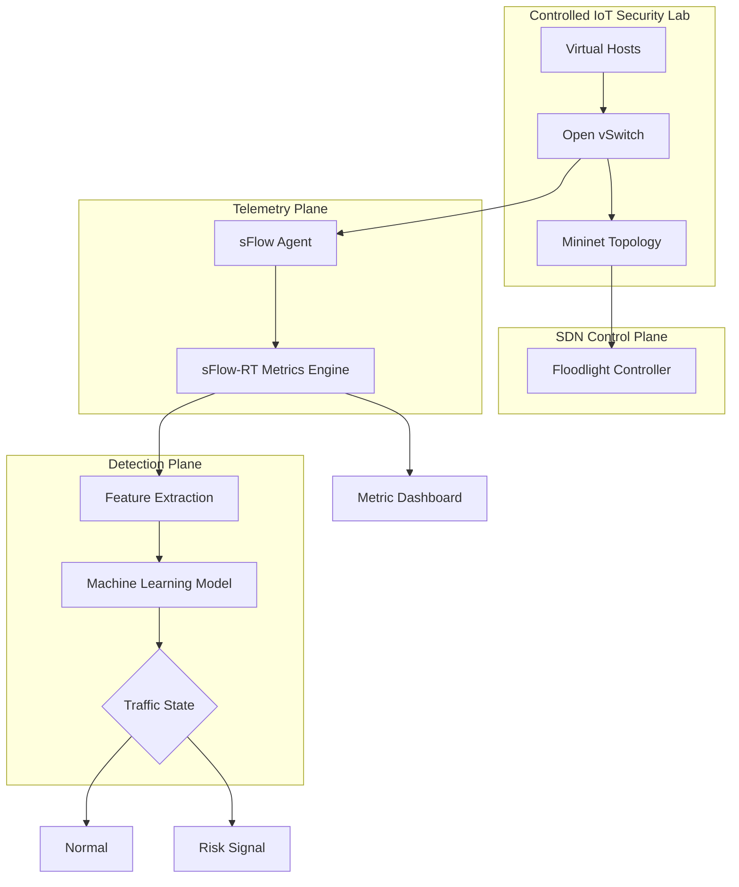
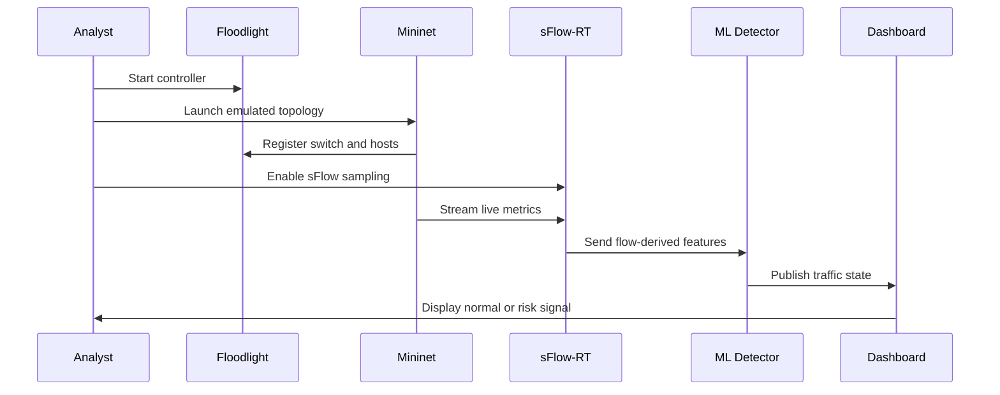
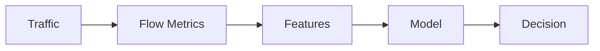
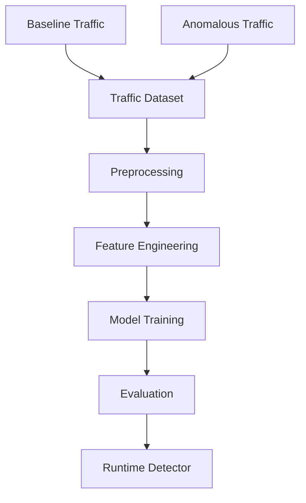

<div align="center">

<br />

# DDoS Attack Detection in IoT

### Real-Time SDN Threat Intelligence Console

<p>
  <strong>Observe live traffic.</strong> <strong>Extract flow signals.</strong> <strong>Classify risk states.</strong>
</p>

<p>
  A premium research-engineering repository for real-time IoT network defense using SDN telemetry and machine learning.
</p>

<p>
  <code>Mininet</code> · <code>Floodlight</code> · <code>sFlow-RT</code> · <code>Open vSwitch</code> · <code>Python</code> · <code>ML Detection</code>
</p>

<br />

<table>
<tr>
<td align="center" width="25%"><strong>Mode</strong><br />Real-Time</td>
<td align="center" width="25%"><strong>Domain</strong><br />IoT Security</td>
<td align="center" width="25%"><strong>Pattern</strong><br />SDN Telemetry</td>
<td align="center" width="25%"><strong>Runtime</strong><br />Ubuntu Lab</td>
</tr>
</table>

<br />

</div>

---

## 01 · Interface Preview

<table>
<tr>
<td width="62%" valign="top">

### Threat intelligence, styled as a clean security console

This project models a compact detection console for an IoT-style software-defined network. It connects an emulated topology, controller-driven networking, live telemetry, and an ML detection layer into one repeatable research workflow.

The design goal is simple: make network behavior visible, measurable, and classifiable in real time.

</td>
<td width="38%" valign="top">

```text
┌──────────────────────────────┐
│  SDN THREAT CONSOLE          │
├──────────────────────────────┤
│  Network     Mininet Lab     │
│  Control     Floodlight      │
│  Telemetry   sFlow-RT        │
│  Model       ML Detector     │
│  Output      Normal / Risk   │
└──────────────────────────────┘
```

</td>
</tr>
</table>

---

## 02 · System Cards

<table>
<tr>
<td width="25%" valign="top">

### Network

Mininet creates a controlled topology for repeatable IoT-style traffic experiments.

</td>
<td width="25%" valign="top">

### Control

Floodlight manages the SDN environment and virtual switch behavior.

</td>
<td width="25%" valign="top">

### Telemetry

sFlow-RT converts flow activity into live operational metrics.

</td>
<td width="25%" valign="top">

### Intelligence

A machine learning layer classifies observed traffic behavior into clean state signals.

</td>
</tr>
</table>

---

## 03 · Architecture



---

## 04 · Real-Time Detection Flow



---

## 05 · Detection Pipeline

<table>
<tr>
<td width="20%" valign="top"><strong>01</strong><br />Traffic observation inside Mininet</td>
<td width="20%" valign="top"><strong>02</strong><br />sFlow sampling from Open vSwitch</td>
<td width="20%" valign="top"><strong>03</strong><br />Metric capture through sFlow-RT</td>
<td width="20%" valign="top"><strong>04</strong><br />Feature extraction for ML inference</td>
<td width="20%" valign="top"><strong>05</strong><br />Normal or risk-state classification</td>
</tr>
</table>



---

## 06 · Key Features

| Feature | Purpose |
|---|---|
| Real-time traffic observation | Tracks live behavior instead of only static logs. |
| SDN-based experiment control | Keeps the network lab structured and repeatable. |
| sFlow telemetry | Provides flow-level visibility for detection signals. |
| ML classification | Converts telemetry into a clean network-state decision. |
| Dashboard workflow | Supports visual analysis through Floodlight and sFlow-RT. |
| Defensive lab scope | Built for authorized research and network defense education. |

---

## 07 · ML Workflow



| Stage | Output |
|---|---|
| Capture | Baseline and anomalous traffic observations. |
| Prepare | Clean numerical features from flow metrics. |
| Train | Supervised model for traffic-state prediction. |
| Evaluate | Accuracy, precision, recall, F1-score, false-positive rate. |
| Deploy | Runtime detector connected to live telemetry. |

---

## 08 · Tech Stack

<table>
<tr>
<td width="25%" valign="top">

**Network Lab**

Mininet  
Open vSwitch  
Ubuntu

</td>
<td width="25%" valign="top">

**Control**

Floodlight  
OpenFlow  
Remote Controller

</td>
<td width="25%" valign="top">

**Telemetry**

sFlow  
sFlow-RT  
Metric Browser

</td>
<td width="25%" valign="top">

**Detection**

Python  
Scikit-learn  
Pandas  
NumPy

</td>
</tr>
</table>

---

## 09 · Installation

> Recommended platform: Ubuntu or a Linux VM with Mininet support.

```bash
git clone https://github.com/ns7523/DDoS-attack-in-IoT-Real-Time.git
cd DDoS-attack-in-IoT-Real-Time
```

```bash
python3 -m venv .venv
source .venv/bin/activate
pip install pandas numpy scikit-learn
```

| Dependency | Role |
|---|---|
| Mininet | Emulated topology runtime. |
| Floodlight | SDN controller. |
| sFlow-RT | Live telemetry engine. |

Reference: [`Installation Guide.pdf`](Installation%20Guide.pdf)

---

## 10 · Usage

Command reference: [`Commands.txt`](Commands.txt)

```bash
cd floodlight
java -jar target/floodlight.jar
```

```bash
sudo mn --controller=remote,ip=127.0.0.1,port=6653 --topo=single,3
```

```bash
cd ns-ddos
sudo ./start.sh
```

```text
Floodlight UI    http://localhost:8080/ui/pages/index.html
sFlow-RT UI      http://localhost:8008/metric/127.0.0.1/html
```

---

## 11 · Traffic Model

| Signal | Description |
|---|---|
| Baseline traffic | Standard host-to-host behavior in the emulated topology. |
| Anomalous traffic | Lab-only network behavior used for detection validation. |
| sFlow metrics | Flow-level telemetry captured through sFlow-RT. |
| Detection output | Normal or risk state from the ML detector. |

---

## 12 · Visual Assets

<table>
<tr>
<td width="50%" valign="top">

### Controller Dashboard

`assets/screenshots/floodlight-dashboard.png`

SDN topology, switch registration, and controller status.

</td>
<td width="50%" valign="top">

### Telemetry Dashboard

`assets/screenshots/sflow-metric-browser.png`

Live sFlow-RT telemetry and flow trends.

</td>
</tr>
<tr>
<td width="50%" valign="top">

### Detection State

`assets/screenshots/detection-state.png`

Normal-versus-risk classification output.

</td>
<td width="50%" valign="top">

### System Map

`assets/screenshots/architecture.png`

Polished architecture diagram for the SDN + ML pipeline.

</td>
</tr>
</table>

---

## 13 · Project Structure

```text
.
├── Commands.txt
├── Installation Guide.pdf
├── README.md
└── project files
```

Recommended structure:

```text
.
├── assets/
│   └── screenshots/
├── data/
│   ├── raw/
│   └── processed/
├── docs/
│   ├── architecture.md
│   ├── detection-methodology.md
│   └── installation.md
├── models/
│   └── detector.pkl
├── results/
│   ├── metrics.json
│   └── latency-report.md
├── scripts/
│   ├── configure-sflow.sh
│   ├── start-controller.sh
│   └── start-mininet.sh
├── src/
│   ├── collector.py
│   ├── detector.py
│   ├── features.py
│   └── monitor.py
└── requirements.txt
```

---

## 14 · Roadmap

- [ ] Add pinned `requirements.txt`.
- [ ] Move runtime logic into `src/`.
- [ ] Add setup scripts for controller, topology, and telemetry.
- [ ] Add screenshots under `assets/screenshots/`.
- [ ] Add model metrics and detection latency report.
- [ ] Add architecture and methodology docs.
- [ ] Add a formal open-source license.

---

## 15 · Defensive Use Notice

This project is for authorized security research, controlled lab experimentation, and defensive network engineering education. Keep all traffic generation inside Mininet or networks you own or have explicit permission to test.

---

<div align="center">

### N S Akash

**AI & Cybersecurity Engineer**

[GitHub](https://github.com/ns7523) · [LinkedIn](https://www.linkedin.com/in/nsakash7523) · [Portfolio](https://nsakash.in) · [Email](mailto:nsakash752003@gmail.com)

</div>
